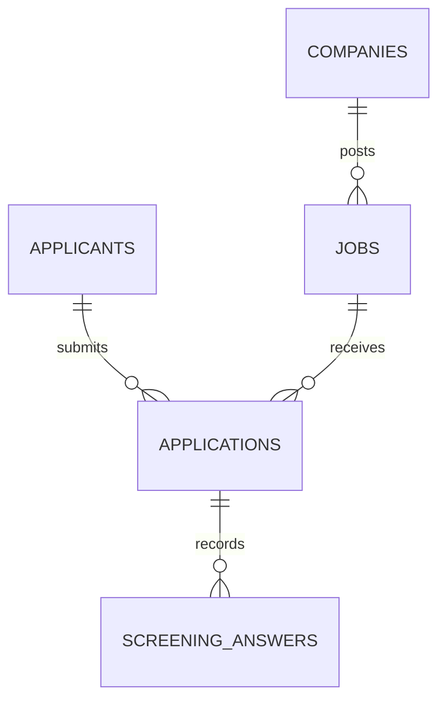

# Ownership and references must stay honest

A job portal is a web of ownership, and every strand has to stay true:

- A **job belongs to exactly one company.** No job should float with a `company_id` that points at no real company.
- An **application references a real job and a real applicant.** You can't have an application pointing at a job that was deleted, or at an applicant who never existed.
- A **screening answer belongs to a real application.** An answer with no application behind it is garbage data.

A relational database enforces all of this *for you*, with **foreign keys**. A **foreign key** is a column whose value must match a real row in another table — and the database refuses any write that breaks the rule. It will *reject* an application whose `job_id` doesn't match a real job, and *refuse* to delete a job that still has applications (unless you deliberately tell it to cascade the delete). That guarantee has a name — **referential integrity**, the database keeping every reference honest — and it's the difference between *"the data can't be wrong"* and *"the data is correct as long as every developer remembers to check, on every code path, forever."*

A document store leaves that checking to your application code. Every place that creates an application has to remember to verify the job still exists; every place that deletes a job has to remember to hunt down and handle its applications. Miss one path — a bulk import, an admin script, a race between two requests — and you've got **orphans**: applications pointing at deleted jobs, answers pointing at nothing. In a relational database, the database simply won't let that state exist.

## The core links, drawn

Here are the relationships the whole portal stands on — read it as "one company has many jobs," "one applicant has many applications," and so on:



Read the diagram as guarantees, not just arrows. Every arrow above is a foreign key the database will enforce: an `APPLICATION` cannot reference a `JOB` that doesn't exist; a `JOB` cannot belong to a `COMPANY` that was deleted; a `SCREENING_ANSWER` cannot dangle without its `APPLICATION`. (Notice an application points at *both* a job and an applicant — that's how "one application per applicant per job" becomes enforceable later.)

In schema terms, each link is one phrase. Here's a job pointing at its company:

```sql
CREATE TABLE jobs (
  id          uuid PRIMARY KEY,
  company_id  uuid NOT NULL REFERENCES companies(id),  -- the foreign key: must point at a REAL company
  -- … the rest of the job's columns (and its JSONB attributes) arrive in Chapter 9
);
```

That single `REFERENCES companies(id)` is the whole guarantee. With it in place, the database **rejects** any job whose `company_id` doesn't match a real company, and **refuses** to delete a company that still has jobs — beneath any bug in your application code, on every path, forever.

This is also the bedrock of the **multi-tenant isolation** you'll build in Week 2 — one company can never touch another's jobs or applicants — because honest ownership is what isolation is built on top of. You'll design these tables in the **data-model module (Chapters 8–14)** and turn the foreign-key rules into hard isolation starting at [Chapter 27](../27-isolation-concept/).
